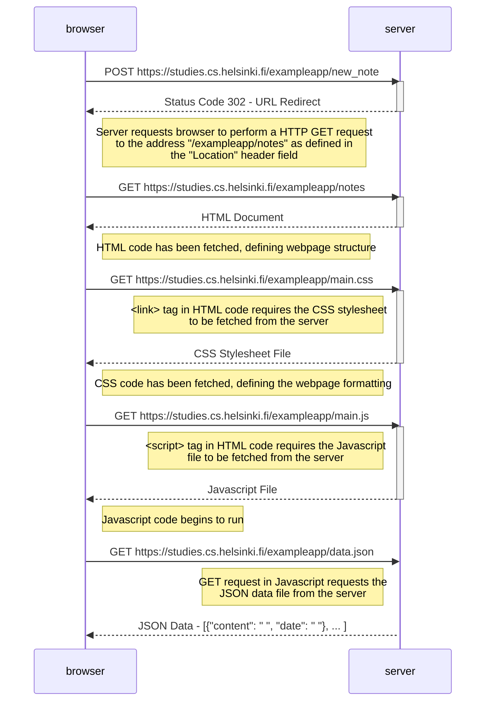

New Note Sequence Diagram

```mermaid
sequenceDiagram
    participant browser
    participant server

    browser->>server: POST https://studies.cs.helsinki.fi/exampleapp/new_note
    activate server
    server-->>browser: Status Code 302 - URL Redirect
    deactivate server
    note right of browser: Server requests browser to perform a HTTP GET request<br>to the address "/exampleapp/notes" as defined in<br>the "Location" header field

    browser->>server: GET https://studies.cs.helsinki.fi/exampleapp/notes
    activate server
    server-->>browser: HTML Document
    deactivate server

    note right of browser: HTML code has been fetched, defining webpage structure

    browser->>server: GET https://studies.cs.helsinki.fi/exampleapp/main.css
    activate server
    note left of server: <link> tag in HTML code requires the CSS stylesheet<br>to be fetched from the server
    server-->>browser: CSS Stylesheet File
    deactivate server
    note right of browser: CSS code has been fetched, defining the webpage formatting

    browser->>server: GET https://studies.cs.helsinki.fi/exampleapp/main.js
    activate server
    note left of server: <script> tag in HTML code requires the Javascript<br>file to be fetched from the server
    server-->>browser: Javascript File
    deactivate server
    note right of browser: Javascript code begins to run

    browser->>server: GET https://studies.cs.helsinki.fi/exampleapp/data.json
    activate server
    note left of server: GET request in Javascript requests the<br>JSON data file from the server
    server-->>browser: JSON Data - [{"content": " ", "date": " "}, ... ]

```