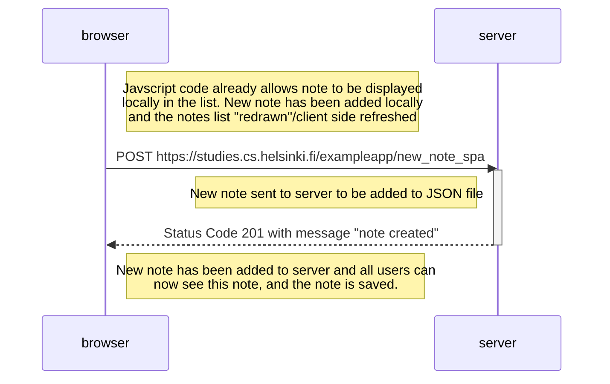

New Note Single Page App Sequence Diagram

```mermaid
sequenceDiagram
    participant browser
    participant server

    note right of browser: Javscript code already allows note to be displayed<br>locally in the list. New note has been added locally<br> and the notes list "redrawn"/client side refreshed
    browser->>server: POST https://studies.cs.helsinki.fi/exampleapp/new_note_spa
    activate server
    note left of server: New note sent to server to be added to JSON file
    server-->>browser: Status Code 201 with message "note created"
    deactivate server
    note right of browser: New note has been added to server and all users can<br>now see this note, and the note is saved.

```